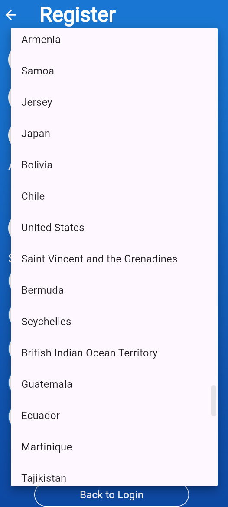

# Habit Tracker (Flutter)

A simple habit tracking app with login/registration, configurable habits, a daily to‑do/done board, profile management, local notifications, and profile/country integration using SharedPreferences and a public API.

## Features

- Login and Registration
  - Default login: `testuser` / `password123`
  - Register saves profile, habits, age, and country to local storage

- Habit Tracker Board
  - To‑do and Done lists with swipe to complete/undo
  - Floating “+” opens Configure (Add Habit) screen

- Drawer Navigation
  - Configure, Personal Info, Reports (placeholder), Notifications, Sign Out
  - Header shows a circular avatar with the user’s initial

- Configure (Add Habit)
  - Create habits with color selection
  - Delete existing habits

- Personal Info
  - Edit name, username, age (slider), and country
  - Country dropdown loads full list from Rest Countries API

- Notifications
  - Enable/disable preference and pick habits/times
  - “Send Test Notification” shows an in‑app alert and a local notification

- Local Storage
  - SharedPreferences utility (`lib/shared_preferences.dart`) for:
    - Profile (name, email, username, age, country, habits)
    - Habit maps (selected/completed)
    - User actions and notifications

## Tech Stack

- Flutter, Dart
- Packages: `shared_preferences`, `http`, `fluttertoast`, `flutter_local_notifications`

## Setup

1) Install Flutter SDK and platform toolchains (Android Studio/Xcode)
2) Get dependencies

```
flutter pub get
```

3) Android permissions (already added)

- `android/app/src/main/AndroidManifest.xml`
  - `<uses-permission android:name="android.permission.INTERNET" />`
  - `<uses-permission android:name="android.permission.POST_NOTIFICATIONS" />` (Android 13+)

4) iOS settings (already added)

- `ios/Runner/Info.plist`
  - `NSAppTransportSecurity` with `NSAllowsArbitraryLoads` for API calls during development

## Run

```
flutter run
```

On first launch, use the default credentials or register a new account.

## Key Files

- `lib/main.dart` – App entry
- `lib/login_screen.dart` – Login flow
- `lib/register_screen.dart` – Registration with country dropdown
- `lib/habit_tracker_screen.dart` – To‑do/Done lists + drawer
- `lib/add_habit_screen.dart` – Configure habits
- `lib/personal_info_screen.dart` – Profile editor
- `lib/notifications_screen.dart` – Local notifications + test alert
- `lib/reports_screen.dart` – Placeholder
- `lib/country_list.dart` – Fetch and normalize countries (Rest Countries API)
- `lib/shared_preferences.dart` – Local storage utility (HabitPrefs)

## Country List

Countries are fetched from `https://restcountries.com/v3.1/all`, normalized (e.g., remove parenthetical aliases) and merged with a curated set to ensure specific names appear. Both Register and Personal Info use this list in their dropdowns.

## Screenshots

Below are example screens captured from this app. Paths refer to files in the `screen/` folder.





## Notes / TODO

- iOS: consider adding specific domain ATS exceptions for production instead of allowing arbitrary loads.
- Notifications: for scheduled habit reminders, add scheduling logic with `flutter_local_notifications`.
- Reports: implement real analytics/visualization.

## Developer

- Name: Zainuddin
- Email: zainuddin@codemaster.my
- Website: https://www.codemaster.my
